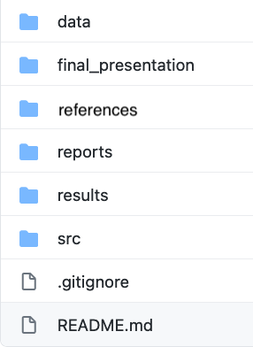

This page contains more specific instructions for each project deliverable as well as their point values for grading. Each point represents 1 percent of total course grade; i.e. since the final project represents 50% of the final grade, you can think of each point as a percentage of the final grade. Ensure your repo is [organized](#github-repository-organization-5-pts) from the start so the TAs can easily find your work for marking.

## Project Proposal Lightning Talks (5 pts)

Your group will prepare a short (5 minute, 5 slides) lightning talk presenting your project proposal. You will push a PDF of your slides to your group project repo, and give the oral presentation in class. Each group member should present at least one slide. Add a link to this file in your main group repo `README.md` file so the TAs can easily find your work for marking. This is a group-level deliverable (one submission per team). 

Rubric: Marks will be based on effective communication of the main ideas of the following four aspects:

* Background/Motivation (1 point)
  - What is already known in the context of this study?
* Question/Hypothesis (2 points)
  - What is the knowledge gap you are trying to fill?
  - What do you expect to find?
* Data (1 point)
  - Describe the content and source of the data you will use?
  - If using previously published data, how will your project differ from previous literature?
* Analysis Plan (1 point)
  - How will you answer your main research question?

## Written Proposal (5 pts)

Create a ~one-page proposal (as a Markdown file called `final_project_proposal.md`). This will be an expanded, more detailed description of your project. Please make sure that you have incorporated the feedback and comments by the professors/TAs on your proposal lightning talks. Add a link to this file in your main group repo `README.md` file so the TAs can easily find your work for marking. Provide references for any sections as needed.

Your project proposal includes:

#### Motivation and background (1 pt)

- What is the relevance and significance of your project?
- What is already known in the context of your project?

#### Question/Hypothesis (1 pt)

- What is the knowledge gap you are trying to fill?
- What do you expect to find?

#### Dataset (1 pt)

- What kind of data are you working with? e.g. what technology was used to generate it?
- What is the general description and characteristics of the data? e.g. how many rows, how many columns, experimental design etc. 
- How will this data help you answer your research question?

#### Aims and methodology (1 pt)

- What are the specific aims that you will address in order to answer your research question?
- For each of the aims, what computational/statistical approaches will you use? (Note: your methodology might change as you are progressing, exploring your data and reading through the literature)
- If you are using data that is previously published, how will your project differ from previous literature?

#### Division of labour (1 pt)

- Who is going to do what? State assignment of tasks and projected contributions for each group members.
- Please provide a table of group members with their background, degree, affiliations and job assignments.


## Progress report (8 pts)

Your group progress report will be a Markdown document called `progress_report.md`. Add a link to this file in your main group repo `README.md` file so the TAs can easily find your work for marking.

#### What has changed based on the final proposal (2 pt.)

- Did your dataset change? If so, why?
- Have you decided to do a different analysis than what was mentioned in your proposal? If so, Why?
- Are there any changes in task assignments of group members?

#### What is the progress of the analyses (4 pts.)

- Since your initial proposal, you should have decided more concretely on what methods to use for each step of your analyses, and employed some of those methods.
- Briefly and concisely explain your methodology and progress for the aims you have investigated so far. Which parts were modified and which parts remained the same?
- What R packages or other tools are you using for your analyses? You do not need to provide your scripts in your report.
- Provide the links to any markdown reports within your repo to refer to the relevant analysis. 
- Provide references.

#### Results (2 pts.)

- What are your primary results? 
- Were you able to answer your hypothesis? Did you have any positive results? If no, postulate a discussion as to why that may be. Provide plots and/or tables to present your results.
- List some challenges that you have encountered or anticipate. How will you address them?

## Final report (10 pts)

This is the final state of your group project repo, including your final written report summarizing your results, all analysis code, and presentation slides. It should contain the materials (or associated live links) an instructor would need to evaluate your work and that a group member would need to reproduce/reuse/extend the work. This is a group-level deliverable.

#### Written report (5 pts)

Think of it as a technical report of your presentation that includes analysis and results. This should generally be GitHub Markdown output of your key statistical results generated from R Markdown analyses. Be sure to:

- Include text throughout explaining the aim and main conclusions of each part.  
- Make sure your code is readable, documented, and could be run by instructors. Make sure you are addressing the important files, such as "inputs" (e.g. links to the dataset(s) you analyzed) and "outputs" (e.g. figures). Provide valid links for the files you use in your scripts. Link to the report in your main README file.

#### GitHub repository organization (5 pts.)

Organizing your project files logically and consistently will help your team and the instructors to keep track of them. One best practice is to create subdirectories for different parts of your analyses. For example:

  * `src`: contains source code (e.g `.R` files)
  * `results`: contains summary figures and/or reports (e.g. `.pdf` or `html` files)
  * `presentation`: contains [presentation slides files](group_project_rubrics.html#presentation-slides-submission)
  * `reports`: contains the project proposal and progress report deliverables
  * The `README.md` file in the root directory of your the group repo should contain the summary of your project content/main results, and links to all deliverables. 
  * Provide a `README.md` file for each subdirectory to summarize its contents and analyses. Your project instructors should be able to go through all of your work just by following your `README.md` file(s). You can include a flow chart if you find it useful. Keep it brief and concise. 
  * You may include any other directories you find helpful.
  
- Example: 

```{r, echo = F, fig.align='center', out.width = "300px", fig.alt = "Example of a group repository directory structure"}

```  

For lots more detail and discussion on project organization and research computing, see [this article](https://swcarpentry.github.io/good-enough-practices-in-scientific-computing/).

#### Presentation slides submission

Your presentation slides files (e.g. `presentation.PPTX` or `presentation.pdf` or `presentation.html`) should be placed in your group repo. If your slides require extra files (e.g. if you used Rmd or Latex), create a subdirectory for those materials. Please provide a link to your final presentation slides in your group repo `README.md`. This is a group-level deliverable and is due with your final report (but is marked as part of your oral presentation).

## Oral presentation (15 pts)

#### Presentation sessions

Each group will prepare one 15 minute oral presentation, which will be followed by 3 minutes for questions. We will have oral presentation sessions on the last three scheduled lecture sessions. Assignments for presentation dates will be posted on Slack. Groups may choose to present synchronously (live), or prerecord their presentation and play the video during their presentation slot. This is a group-level deliverable, and all group members should participate, and be present during the presentation even if prerecorded so they can answer questions. In addition, each individual will randomly be assigned 2 other group presentations to peer review (see [Individual report](#individual-report-7-pts)), so be sure to be present during the other presentation days as well.

Resources for pre-recording presentations: If you choose to prerecord your group presentation, you may do so using a variety of tools. One option is to record during a group meeting using [Microsoft Teams](https://support.microsoft.com/en-us/office/record-a-meeting-in-teams-34dfbe7f-b07d-4a27-b4c6-de62f1348c24) or [Zoom](https://support.zoom.us/hc/en-us/articles/201362473-Local-recording). Another option is to record in [Powerpoint](https://support.microsoft.com/en-us/office/record-a-presentation-2570dff5-f81c-40bc-b404-e04e95ffab33). You could also use screencast software such as [QuickTime for Mac](https://support.apple.com/en-ca/guide/quicktime-player/qtp97b08e666/mac). If you need advice (or have advice to share) on recording/editing software for your system, please post in the Discussion repo.

#### [Presentation evaluation](course-admin/ProjectPresentationRubric.pdf)

Your oral presentation is evaluated in 4 major categories:

1. Background/introduction (3 points)
2. Statistical analysis (4 points)
3. Quality of presentation (4 points)
4. Scientific maturity (4 points)

You can find the full detailed rubric for presentation evaluation in each of these categories [here](course-admin/ProjectPresentationRubric.pdf).

## Individual report (7 pts)

A one-page individual report as `individual_report.md` is an individual deliverable and should be in an individual private repository (it will have its own invitation link on Canvas). The report includes:

#### Peer evaluation (2 pts)

- You will be randomly assigned to provide peer feedback for two (2) oral presentations from other teams.
- Following the presentations, please review and provide constructive feedback using the 4-component [Reflect Inquire Suggest Elevate (RISE) model of peer feedback](https://www.risemodel.com/s/RISE-Model-Peer-EmilyWray.pdf). Include a statement/question for each of the 4 RISE components. 
- Please copy and paste each of your peer reviews in the [Slack #peer-review channel](https://stat540students.slack.com/archives/peer-review) (so that the teams can receive your feedback), and include links to these messages in this report.


#### A concise summary of contributions of each group member (2 pts)

- Describes the tasks and contributions of each of your group members
- Do you think the task assignments were fairly assigned and appropriate given each member’s background and skills? If no, how would you change it?


#### Your specific contributions and comments (2 pts)

- Explain what are your contributions to the project?
- What worked well and what did not? What was the most challenging or rewarding moment during your group project?
- How did you find having members of different backgrounds for a scientific project? 
- What have you learned from this group project? 
- Any other comments on how the group project could have been structured differently (i.e. delivery requirements, assessment) 

#### Would you like to share your presentation? (1 pt)

Thanks to your feedback, we would like to make project presentation slides available to future students with your consent. Indicate which of the following statements is true (mark in this section is for completion; you will earn 1 point as long as you include one of these statements):

<ol type="a">
  <li>I consent to sharing of my team's final presentation slides on the course website for the benefit of future enrolled students as well as potential students.</li>
  <li>I consent to sharing of my team's final presentation slides via Canvas for the benefit of future enrolled students only.</li>
  <li>I do not consent to sharing of my team's final presentation slides with anyone.</li>
</ol>

Note that slides will only be shared on the course website if all individuals in your team provide consent level a. Likewise, slides will only be shared on Canvas if all individuals in your team provide consent level a or b. If at least one person in the team selects option c (or does include a statement at all), your slides will not be shared with anyone. Note also that if you have used data that is not publicly available, it is your responsibility to first obtain consent from the data custodian if you choose option a or b.  
