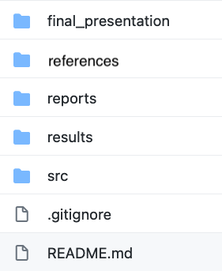

This page contains more specific instructions for each project deliverable as well as their point values for grading. Each point represents 1 percent of total course grade; i.e. since the final project represents 50% of the final grade, you can think of each point as a percentage of the final grade. Ensure your repo is [organized](#github-repository-10-pts) from the start so the TAs can easily find your work for marking.

## Project groups & Initial Proposal (0 pts)

A brief (1-paragraph) initial proposal along with group member information. This is not assigned any grade, but you will need to submit it by the due date in order to receive timely feedback that you can use in writing your finalized proposal (see next item). 

Copy and paste the raw example text below into a Markdown file (called `initial_project_proposal.md`) in your newly created group project repo, and fill in your team's info. The first part will be rendered as a table in Markdown. Add a link to this file in your main group repo `README.md` file so the TAs can easily find your work for marking. This is a group-level deliverable (one submission per team).

```
| Name | Department/Program | Expertise/Interests |GitHub ID | 
| ------------- | ------------- | ------------- | ------------- |
| example: Keegan Korthauer | Statistics |  Epigenetics, Selection-corrected inference |  `@kdkorthauer` |
|  |   |  | 
|  |   |  |
|  |   |  |

Team name: 

One paragraph on the basic idea of the project: 
```

## Proposal (5 pts)

Create a ~one-page proposal (as a Markdown file called `final_project_proposal.md`). Please make sure that you have incorporated the feedback and comments by the professors/TAs on your initial proposal. Add a link to this file in your main group repo `README.md` file so the TAs can easily find your work for marking. 

Your project proposal includes:

#### Motivation and background work (1 pt)

- State the background and rationale for the study.
- What is the overall hypothesis and objectives for the project?
- Why is it important to answer this question? Identify knowledge gaps.

#### Division of labour (1 pt)

- Who is going to do what? State assignment of tasks and projected contributions for each group members.
- Please provide a table of group members with their background, degree, affiliations and job assignments.

#### Dataset (1 pt)

- What kind of data are you working with? What is the general description and characteristics of the data?
- State the technology used to generate the data.
- If your data is small enough, create a read only subdirectory called `data` and keep your data there (see example project repo figure).
- Add a `README.md` file in the subdirectory to describe your data in more detail, e.g., how many rows, how many columns, experimental design etc.

#### Aims and methodology (2 pt)

- What are the specific questions/aims that you will address in order to achieve the final goals of the project?
- For each of the aims, what computational/statistical approaches did you use? (Note: your methodology might change as you are progressing, exploring your data and reading through the literature)
- Provide references for any sections as needed.


## Progress report (8 pts)

Your group progress report will be a Markdown document called `progress_report.md`. Add a link to this file in your main group repo `README.md` file so the TAs can easily find your work for marking.

#### What has changed based on the final proposal (2 pt.)

- Did your dataset change? If so, why?
- Have you decided to do a different analysis than what was mentioned in your proposal? If so, Why?
- Are there any changes in task assignments of group members?

#### What is the progress of the analyses (4 pts.)

- Since your initial proposal, you should have decided more concretely on what methods to use for each step of your analyses, and employed some of those methods.
- Briefly and concisely explain your methodology and progress for the aims you have investigated so far. Which parts were modified and which parts remained the same?
- What R packages or other tools are you using for your analyses? You do not need to provide your scripts in your report.
- Provide the links to any markdown reports within your repo to refer to the relevant analysis. 
- Provide references.

#### Results (2 pts.)

- What are your primary results? 
- Were you able to answer your hypothesis? Did you have any positive results? If no, postulate a discussion as to why that may be. Provide plots and/or tables to present your results.
- List some challenges that you have encountered or anticipate. How will you address them?

## GitHub repository (10 pts)

This is the final state of your group project repo, including all analysis code, summary of results, and presentation slides. It should contain the materials (or associated live links) an instructor would need to evaluate your work and that a group member would need to reproduce/reuse/extend the work. This is a group-level deliverable.

#### GitHub organization (5 pts.)

Create subdirectories for different parts of your analyses. For example:

  * `src`: contains source code (e.g `.R` files)
  * `results`: contains summary figures and/or reports (e.g. `.pdf` or `html` files)
  * `presentation`: contains [presentation slides files](group_project_rubrics.html#presentation-slides-submission)
  * `reports`: contains the project proposal and progress report deliverables
  * The `README.md` file in the root directory of your the group repo should contain the summary of your project content/main results, and links to all deliverables. 
  * Provide a `README.md` file for each subdirectory to summarize its contents and analyses. Your project instructors should be able to go through all of your work just by following your `README.md` file(s). You can include a flow chart if you find it useful. Keep it brief and concise. 
  * You may include any other directories you find helpful.
  
- Example: 

```{r, echo = F, fig.align='center', out.width = "300px", fig.alt = "Example of a group repository directory structure"}

```  


#### Analysis and results (5 pts)

- Think of it as a technical report of your presentation. Add brief comments and text throughout explaining the aim and conclusions of each part. You do not need to talk about all the analysis you have done but make sure you are addressing the important files, such as "inputs" (e.g. the dataset(s) you analyzed) and "outputs")
- This should generally be GitHub Markdown output of your key statistical results generated from R Markdown analyses.
- Link to the report in your main README file.
- Make sure your code is readable and could be run by instructors. So, it is necessary to provide valid addresses for the files you use in your scripts. Add comments for different chunks of your code and document it.

## Oral presentation (20 pts)

#### Presentation sessions

Each group will prepare one 15 minute oral presentation, which will be followed by 3 minutes for questions. We will have oral presentation sessions on the last three scheduled lecture sessions. These sessions **will be recorded** (only made available to teaching team and registered students). Assignments for presentation dates will be posted in the Discussion repo. Groups may choose to present synchronously (live), or prerecord their presentation and play the video during their presentation slot. This is a group-level deliverable, and all group members should be present during the presentation even if prerecorded so they can answer questions. In addition, each individual will randomly be assigned 2 other group presentations to peer review (see [Individual report](#individual-report-7-pts)), so be sure to be present during the other presentation days as well.

Resources for pre-recording presentations: If you choose to prerecord your group presentation, you may do so using a variety of tools. One option is to record during a group meeting using [Microsoft Teams](https://support.microsoft.com/en-us/office/record-a-meeting-in-teams-34dfbe7f-b07d-4a27-b4c6-de62f1348c24) or [Zoom](https://support.zoom.us/hc/en-us/articles/201362473-Local-recording). Another option is to record in [Powerpoint](https://support.microsoft.com/en-us/office/record-a-presentation-2570dff5-f81c-40bc-b404-e04e95ffab33). You could also use screencast software such as [QuickTime for Mac](https://support.apple.com/en-ca/guide/quicktime-player/qtp97b08e666/mac). If you need advice (or have advice to share) on recording/editing software for your system, please post in the Discussion repo.

#### [Presentation evaluation](course-admin/ProjectPresentationRubric.pdf)

Your oral presentation is evaluated in 4 major categories:

1. Background/introduction
2. Statistical analysis
3. Quality of presentation
4. Scientific maturity

You can find the full detailed rubric for presentation evaluation in each of these categories [here](course-admin/ProjectPresentationRubric.pdf).

#### Presentation slides submission

Your presentation slides files (e.g. `presentation.PPTX` or `presentation.pdf` or `presentation.html`) should be placed in your group repo. If your slides require extra files (e.g. if you used Rmd or Latex), create a subdirectory for those materials. Please provide a link to your final presentation slides in your group repo `README.md`. This is a group-level deliverable and is due with your GitHub Repo.

## Individual report (7 pts)

A one-page individual report as `individual_report.md` is an individual deliverable and should be in an individual private repository (it will have its own invitation link on Canvas). The report includes:

#### Peer evaluation (2 pts)

- You will be randomly assigned to provide peer feedback for two (2) oral presentations from other teams.
- Following the presentations, please review and provide constructive feedback using the 4-component [Reflect Inquire Suggest Elevate (RISE) model of peer feedback](https://www.risemodel.com/s/RISE-Model-Peer-EmilyWray.pdf). Include a statement/question for each of the 4 RISE components. 
- Please copy and paste each of your peer reviews as a discussion post in the discussion repo (so that the teams can receive your feedback), and include links to these posts in this report.


#### A concise summary of contributions of each group member (2 pts)

- Describes the tasks and contributions of each of your group members
- Do you think the task assignments were fairly assigned and appropriate given each member’s background and skills? If no, how would you change it?


#### Your specific contributions and comments (3 pts)

- Explain what are your contributions to the project?
- What worked well and what did not? What was the most challenging or rewarding moment during your group project?
- How did you find having members of different backgrounds for a scientific project? 
- What have you learned from this group project? 
- Any other comments on how the group project could have been structured differently (i.e. delivery requirements, assessment") 

